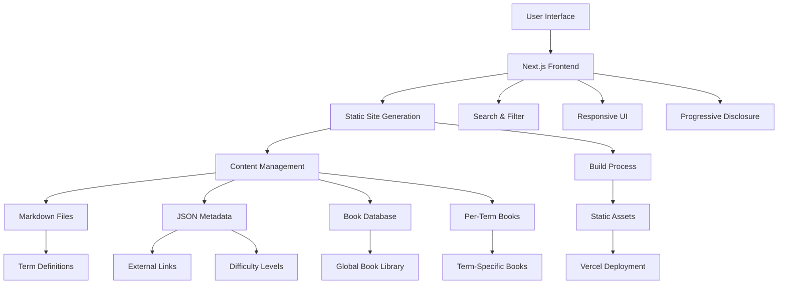
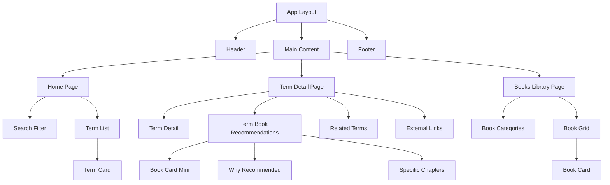

# AI/ML Glossary Learning Portal - Updated Architecture Plan

## Project Overview
A Next.js-based learning portal targeting mixed audiences with beginner-friendly brief definitions that expand into detailed explanations, featuring 20-30 core ML/AI terms with per-term book recommendations AND a global authoritative book library.

## Updated System Architecture



## Updated File Structure

```
ai-glossary/
├── README.md
├── package.json
├── next.config.js
├── tailwind.config.js
├── tsconfig.json
├── .gitignore
├── .env.local
│
├── public/
│   ├── favicon.ico
│   ├── logo.svg
│   └── images/
│       └── book-covers/
│
├── src/
│   ├── app/
│   │   ├── layout.tsx
│   │   ├── page.tsx
│   │   ├── globals.css
│   │   ├── term/
│   │   │   └── [slug]/
│   │   │       └── page.tsx
│   │   └── books/
│   │       └── page.tsx
│   │
│   ├── components/
│   │   ├── ui/
│   │   │   ├── Button.tsx
│   │   │   ├── Card.tsx
│   │   │   ├── Badge.tsx
│   │   │   └── SearchInput.tsx
│   │   ├── layout/
│   │   │   ├── Header.tsx
│   │   │   ├── Footer.tsx
│   │   │   └── Navigation.tsx
│   │   ├── glossary/
│   │   │   ├── TermCard.tsx
│   │   │   ├── TermDetail.tsx
│   │   │   ├── TermList.tsx
│   │   │   ├── SearchFilter.tsx
│   │   │   └── TermBookRecommendations.tsx
│   │   └── books/
│   │       ├── BookCard.tsx
│   │       ├── BookList.tsx
│   │       └── BookGrid.tsx
│   │
│   ├── lib/
│   │   ├── content.ts
│   │   ├── books.ts
│   │   ├── search.ts
│   │   ├── utils.ts
│   │   └── types.ts
│   │
│   └── styles/
│       └── components.css
│
├── content/
│   ├── terms/
│   │   ├── machine-learning.md
│   │   ├── neural-networks.md
│   │   ├── deep-learning.md
│   │   ├── supervised-learning.md
│   │   ├── unsupervised-learning.md
│   │   ├── reinforcement-learning.md
│   │   ├── artificial-intelligence.md
│   │   ├── algorithm.md
│   │   ├── training-data.md
│   │   ├── feature-engineering.md
│   │   ├── overfitting.md
│   │   ├── underfitting.md
│   │   ├── cross-validation.md
│   │   ├── gradient-descent.md
│   │   ├── backpropagation.md
│   │   ├── convolutional-neural-network.md
│   │   ├── recurrent-neural-network.md
│   │   ├── transformer.md
│   │   ├── natural-language-processing.md
│   │   ├── computer-vision.md
│   │   ├── classification.md
│   │   ├── regression.md
│   │   ├── clustering.md
│   │   ├── decision-tree.md
│   │   ├── random-forest.md
│   │   ├── support-vector-machine.md
│   │   ├── k-means.md
│   │   ├── linear-regression.md
│   │   └── logistic-regression.md
│   │
│   ├── books/
│   │   ├── global-library.json
│   │   └── term-books/
│   │       ├── machine-learning.json
│   │       ├── neural-networks.json
│   │       ├── deep-learning.json
│   │       ├── supervised-learning.json
│   │       ├── natural-language-processing.json
│   │       ├── computer-vision.json
│   │       └── [other-term-books].json
│   │
│   └── resources/
│       └── external-links.json
```

## Updated Content Structure Design

### Enhanced Term Markdown Format
```markdown
---
title: "Machine Learning"
slug: "machine-learning"
category: "Fundamentals"
difficulty: "beginner"
tags: ["ai", "algorithms", "data-science"]
related: ["supervised-learning", "unsupervised-learning", "deep-learning"]
recommendedBooks: ["hands-on-ml", "pattern-recognition", "elements-statistical-learning"]
lastUpdated: "2025-01-28"
---

# Brief Definition
A subset of artificial intelligence that enables computers to learn and make decisions from data without being explicitly programmed.

# Detailed Explanation
[Comprehensive explanation with examples, use cases, and technical details]

# Key Concepts
- Pattern recognition
- Data-driven decisions
- Automated learning

# Common Applications
- Image recognition
- Recommendation systems
- Predictive analytics

# Prerequisites
- Basic statistics
- Programming fundamentals
- Linear algebra (helpful)
```

### Per-Term Book Recommendations Structure
```json
// content/books/term-books/machine-learning.json
{
  "termSlug": "machine-learning",
  "books": [
    {
      "id": "hands-on-ml",
      "title": "Hands-On Machine Learning with Scikit-Learn, Keras, and TensorFlow",
      "authors": ["Aurélien Géron"],
      "isbn": "978-1492032649",
      "description": "Practical guide to machine learning with hands-on examples and real-world applications.",
      "difficulty": "intermediate",
      "relevanceScore": 10,
      "specificChapters": ["Chapter 1: The Machine Learning Landscape", "Chapter 2: End-to-End Machine Learning Project"],
      "whyRecommended": "Best practical introduction to ML with code examples and real projects",
      "amazonLink": "https://amazon.com/...",
      "rating": 4.6,
      "coverImage": "/images/book-covers/hands-on-ml.jpg"
    },
    {
      "id": "pattern-recognition",
      "title": "Pattern Recognition and Machine Learning",
      "authors": ["Christopher Bishop"],
      "isbn": "978-0387310732",
      "description": "Comprehensive theoretical foundation of machine learning algorithms.",
      "difficulty": "advanced",
      "relevanceScore": 9,
      "specificChapters": ["Chapter 1: Introduction", "Chapter 3: Linear Models for Regression"],
      "whyRecommended": "Definitive theoretical treatment of ML fundamentals",
      "amazonLink": "https://amazon.com/...",
      "rating": 4.4,
      "coverImage": "/images/book-covers/pattern-recognition.jpg"
    }
  ]
}
```

### Global Book Library Structure
```json
// content/books/global-library.json
{
  "categories": {
    "fundamentals": {
      "title": "Fundamentals & Theory",
      "books": ["pattern-recognition", "elements-statistical-learning", "introduction-statistical-learning"]
    },
    "practical": {
      "title": "Practical & Applied",
      "books": ["hands-on-ml", "python-machine-learning", "machine-learning-yearning"]
    },
    "deep-learning": {
      "title": "Deep Learning",
      "books": ["deep-learning-goodfellow", "deep-learning-with-python", "neural-networks-deep-learning"]
    },
    "specialized": {
      "title": "Specialized Topics",
      "books": ["nlp-with-python", "computer-vision-modern-approach", "reinforcement-learning-introduction"]
    }
  },
  "books": {
    "hands-on-ml": {
      "title": "Hands-On Machine Learning with Scikit-Learn, Keras, and TensorFlow",
      "authors": ["Aurélien Géron"],
      "isbn": "978-1492032649",
      "description": "Practical guide to machine learning with hands-on examples.",
      "difficulty": "intermediate",
      "topics": ["machine-learning", "deep-learning", "neural-networks"],
      "amazonLink": "https://amazon.com/...",
      "rating": 4.6,
      "coverImage": "/images/book-covers/hands-on-ml.jpg",
      "publishYear": 2019,
      "pages": 851
    }
    // ... more books
  }
}
```

## Updated Component Architecture



## Updated Data Models

### Enhanced Term Interface
```typescript
interface Term {
  title: string;
  slug: string;
  category: string;
  difficulty: 'beginner' | 'intermediate' | 'advanced';
  tags: string[];
  related: string[];
  recommendedBooks: string[]; // Book IDs
  lastUpdated: string;
  briefDefinition: string;
  detailedExplanation: string;
  keyConcepts: string[];
  applications: string[];
  prerequisites: string[];
  externalLinks: ExternalLink[];
}
```

### Term Book Recommendation Interface
```typescript
interface TermBookRecommendation {
  id: string;
  title: string;
  authors: string[];
  isbn: string;
  description: string;
  difficulty: 'beginner' | 'intermediate' | 'advanced';
  relevanceScore: number; // 1-10
  specificChapters: string[];
  whyRecommended: string;
  amazonLink: string;
  rating: number;
  coverImage: string;
}

interface TermBooks {
  termSlug: string;
  books: TermBookRecommendation[];
}
```

### Global Book Library Interface
```typescript
interface GlobalBook {
  title: string;
  authors: string[];
  isbn: string;
  description: string;
  difficulty: 'beginner' | 'intermediate' | 'advanced';
  topics: string[]; // Related term slugs
  amazonLink: string;
  rating: number;
  coverImage: string;
  publishYear: number;
  pages: number;
}

interface BookCategory {
  title: string;
  books: string[]; // Book IDs
}

interface GlobalLibrary {
  categories: Record<string, BookCategory>;
  books: Record<string, GlobalBook>;
}
```

## Enhanced Features

### 1. Per-Term Book Recommendations
- **Curated Selection**: 3-5 most relevant books per term
- **Relevance Scoring**: Books ranked by relevance to specific topic
- **Specific Chapters**: Highlight most relevant chapters/sections
- **Difficulty Matching**: Books appropriate for term's difficulty level
- **Why Recommended**: Explanation of book's relevance to the term

### 2. Global Book Library
- **Comprehensive Collection**: All recommended books across all terms
- **Category Organization**: Fundamentals, Practical, Deep Learning, Specialized
- **Cross-Reference System**: Books linked to multiple relevant terms
- **Advanced Filtering**: By difficulty, topic, rating, publication year

### 3. Book Integration Features
- **Smart Recommendations**: Books appear in multiple relevant terms
- **Progress Tracking**: Mark books as "read" or "want to read"
- **Rating System**: Community ratings and reviews
- **Purchase Links**: Direct links to Amazon, bookstores

## Updated Development Phases

### Phase 1: Foundation
- Project setup and configuration
- Basic layout and navigation
- Content structure with book integration

### Phase 2: Core Features
- Term listing and search functionality
- Expandable term details with book recommendations
- Global book library implementation

### Phase 3: Book Enhancement
- Per-term book recommendation system
- Book filtering and search
- Cross-reference system between terms and books

### Phase 4: Polish
- Advanced book features (ratings, reviews)
- SEO optimization for book pages
- Performance optimization and content expansion

This updated architecture provides a comprehensive book recommendation system that serves both term-specific learning paths and a broader library for comprehensive study planning.